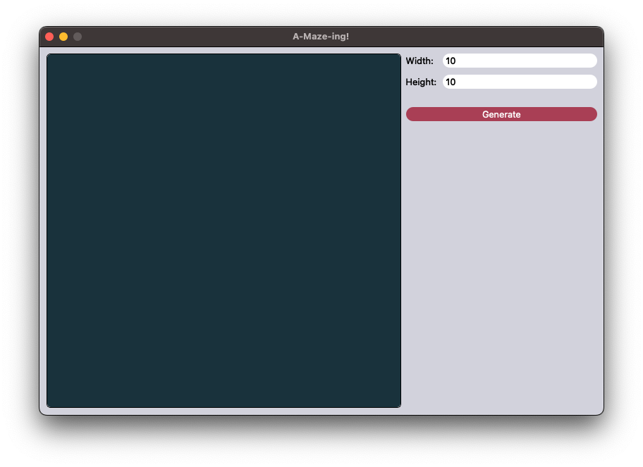
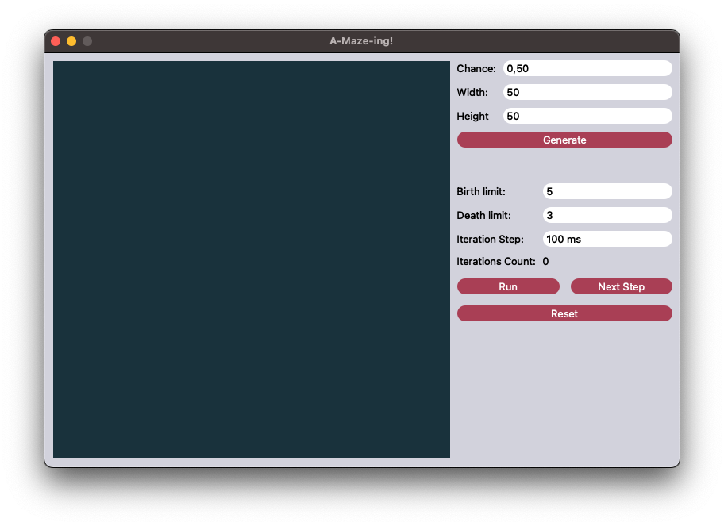
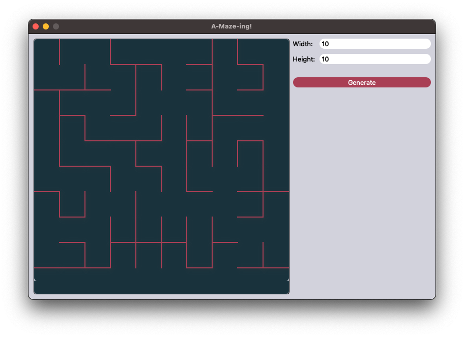
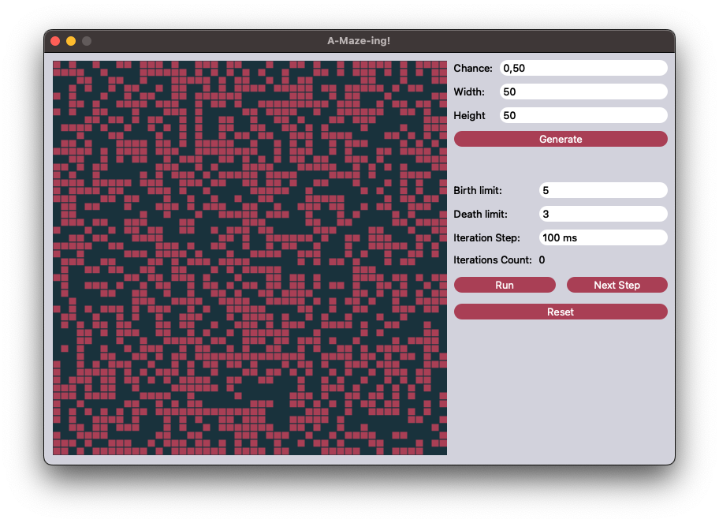
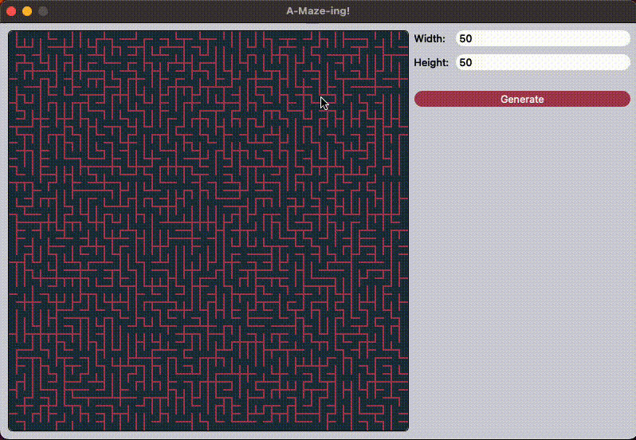
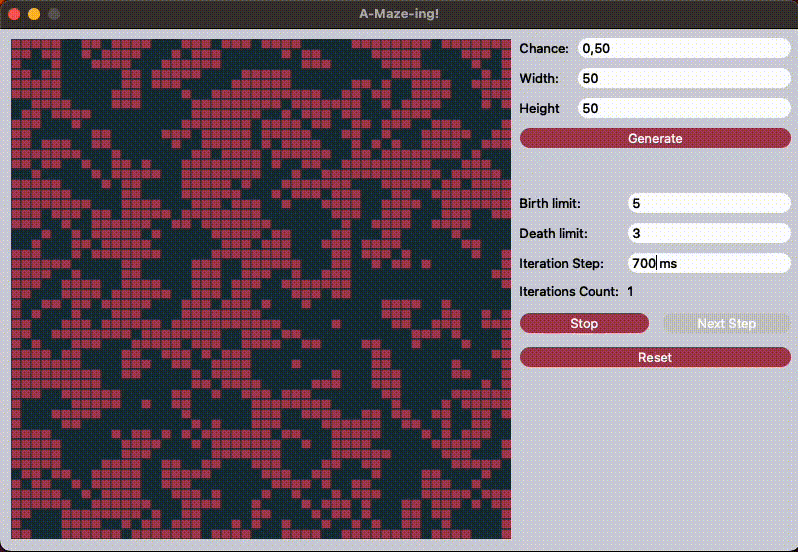

# A-Maze-ing
**A-maze-ing** is a desktop app for Maze generation and solving, Cave generation using a cellular automaton. <br>
It's a group project. I developed and tested model part for Maze, refactored model part for Cave.

## Installation
### MacOS
Note: uses qmake6 <br>
Use this command form <b>src</b> directory to install application:
```shell
make install
```
After install you can find application in your home directory inside Applications directory.

## Usage

When you open <b>A-Maze-ing!</b> you will se a window with Maze tab. To switch between tabs use ⌘ + 1 (for Maze tab) and ⌘ + 2 (for Cave tab):



To generate new maze just set width and height in range from 1 to 50 and press <b>Generate</b> button. To generate cave you also need to set chance of generating alive cell and then press <b>Generate</b> button.




To upload cave or maze, open corresponding tab and press ⌘ + O. Then file dialog will open, choose .txt file and press <b>Open</b> button.

An example of such a file for Maze:
```
4 4
0 0 0 1
1 0 1 1
0 1 0 1
0 0 0 1

1 0 1 0
0 0 1 0
1 1 0 1
1 1 1 1
```

An example of such a file for Cave:
```
4 4
0 1 0 1
1 0 0 1
0 1 0 0
0 0 1 1
```

You can also upload file just simply using drag and drop feature.

After file is uploaded you can start working with it.

### Solving Maze

To solve maze just press in spot where you want to be a start of the solving path and release in other spot where you want to be an end of the solving path.

If you want to clear solved path, just press and release immediately in any spot inside viewport



### Iterating through Cave

To iterate through Cave you must first set Birth and Death limits in range from 1 to 7, then press <b>Next Step</b> button to iterate.

### Autorun iteration through Cave

When you press Run, Cave will start iterating pereodicaly acording to parameter <b>Iteration Step</b> which can be set in corresponding field in milleseconds. Press stop if you want to stop autorun mode



### Reseting Cave

To reset Cave to its initial state press <b>Reset</b> button

## Uninstall

To unninstall application just enter <b>src</b> directory and run a command:
```shell
make uninstall
```
Also you can explicitly delete app from Applications directory
